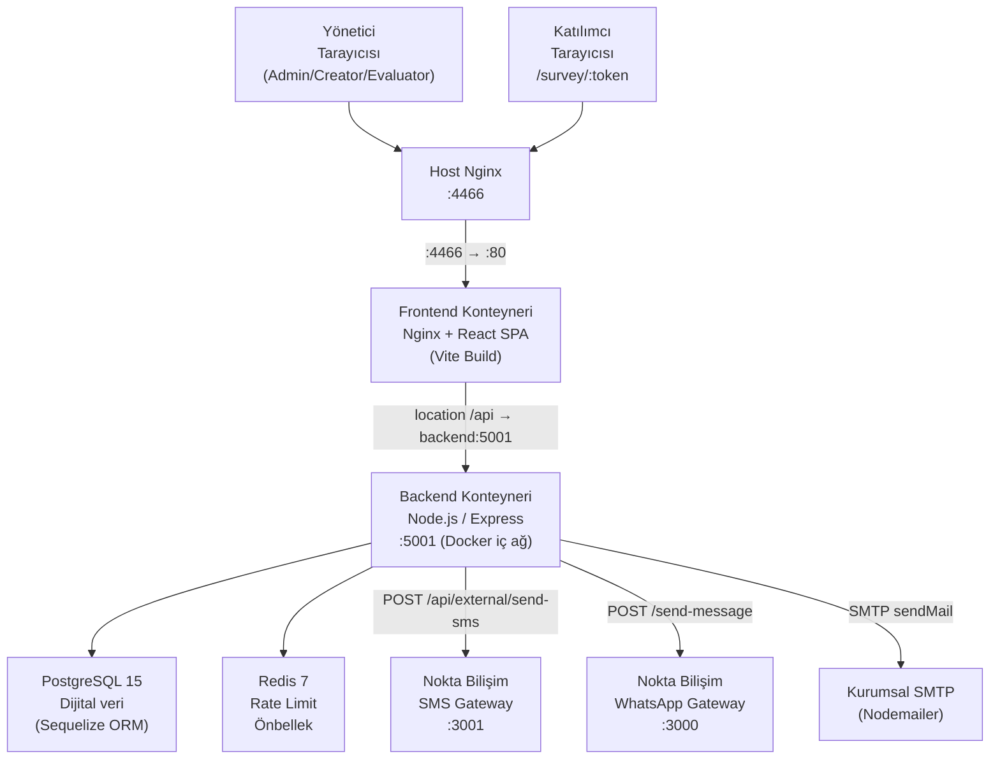
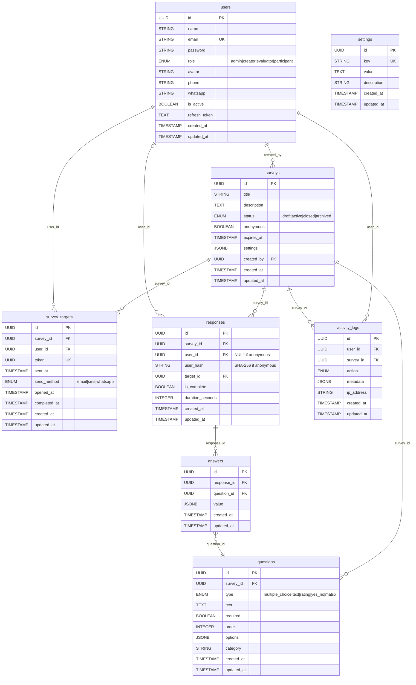

# Mimari — SurveyPro (Anket Yönetim Sistemi)

Tarih: 2026-09-19  
Sürüm: 1.0  
Durum: ONAYLI

---

## 1. Özet ve Kısıtlar

### 1.1 Amaç
SurveyPro, kurumların çalışanlarına ve paydaşlarına yönelik anketleri tasarlamasını, çok kanallı bildirim (E-posta, SMS, WhatsApp) ile dağıtmasını ve yanıtları puanlama ile kategori bazlı analiz modelleriyle gerçek zamanlı ölçümlemesini sağlayan kurumsal bir anket yönetim platformudur.

### 1.2 Kısıtlar
| No | Kısıt | Açıklama |
|---|---|---|
| K-1 | Stack değişmez | Mevcut Node.js/Express + Sequelize + PostgreSQL + React (Vite) + Redis yığını korunur. |
| K-2 | Tek kiracı | İlk sürüm tek organizasyon içindir; multi-tenant izolasyon sonraki büyük sürüme bırakılmıştır. |
| K-3 | Port ve ağ | Prod sunucuda frontend 4466/TCP, backend 5001/TCP (sadece Docker iç ağ). Host Nginx 80/443 başka servislere ayrılmış; yeni yayın farklı TCP portlarından gelir. |
| K-4 | Güvenlik | Bcrypt (cost 12), JWT (15 dk Access + 7 gün Refresh), UUIDv4 token, rate limiting, Helmet güvenlik başlıkları zorunludur. |
| K-5 | KVKK | Anonim anketlerde katılımcı kimlikleri SHA-256 hash ile gizlenir; açık metin PII yanıt kayıtlarıyla ilişkilendirilmez. |
| K-6 | Bağlı harici servisler | Nokta Bilişim SMS Gateway ve WhatsApp Gateway; kurumsal SMTP sunucusu. |
| K-7 | Excel/CSV dışa-içe aktarım | `xlsx` kütüphanesi ile bellek-içi (streaming olmayan) üretim yeterli; 50.000+ yanıt seviyesine ulaşıldığında ExcelJS streaming geçişi yapılacak (genişleme noktası: `exportExcel.js`). |

### 1.3 Kapsam Dışı (Bu Sürümde Yok)
- Koşullu soru dallanması (Skip Logic)
- OAuth / SSO / 2FA
- Native mobil uygulama
- Çok dilli anket içeriği (i18n)
- Ödeme / ücretli anket modülü

---

## 2. Bileşen Diyagramı ve Sorumluluklar



### 2.1 Sorumluluk Tablosu

| Bileşen | Sorumluluk |
|---|---|
| **Host Nginx (:4466)** | TCP porttan gelen istekleri Frontend konteynerine yönlendirir. SSL termination yapılabilir. |
| **Frontend Konteyneri** | Nginx statik SPA sunumu + `/api` yollarını `backend:5001`'e reverse-proxy iletimi, Gzip sıkıştırma. |
| **React SPA** | Yönetim paneli (tüm roller), anket editörü, raporlama, login ve katılımcı anket arayüzü. |
| **Backend Express** | JWT kimlik doğrulama, RBAC yetkilendirme, tüm iş mantığı, bildirim gönderim, Excel export. |
| **PostgreSQL** | Kalıcı veri saklama (anketler, sorular, yanıtlar, kullanıcılar, audit log, ayarlar). |
| **Redis** | Rate limiting (`express-rate-limit`), önbellek katmanı. |
| **Nokta Bilişim SMS** | SMS dağıtım gateway'i (REST API). |
| **Nokta Bilişim WhatsApp** | WhatsApp dağıtım gateway'i (REST API). |
| **Kurumsal SMTP** | E-posta gönderim altyapısı (Nodemailer). |

---

## 3. Veri Modeli (Varlıklar, Alanlar, Tipler, İlişkiler, İndeksler, Silme Stratejisi)

### 3.1 Varlık İlişki Diyagramı



### 3.2 JSONB Alan Yapıları

#### `questions.options` — Soru Tipine Göre

**multiple_choice / yes_no:**
```json
[
  { "text": "Kesinlikle Katılıyorum", "score": 5 },
  { "text": "Katılıyorum", "score": 4 },
  { "text": "Evet", "score": 1 },
  { "text": "Hayır", "score": 0 }
]
```

**rating:**
```json
[]
```
*(Puan doğrudan `answers.value` (1-10 sayısal değer) olarak alınır.)*

**matrix:**
```json
{
  "rows": [
    { "text": "Liderlik becerileri" },
    { "text": "İletişim etkinliği" }
  ],
  "columns": [
    { "text": "Çok İyi", "score": 5 },
    { "text": "İyi",    "score": 4 },
    { "text": "Orta",   "score": 3 },
    { "text": "Zayıf",  "score": 2 },
    { "text": "Çok Zayıf", "score": 1 }
  ]
}
```

#### `answers.value` — Soru Tipine Göre

| Soru Tipi | `value` Tipi | Örnek |
|---|---|---|
| `multiple_choice` | `string[]` | `["Katılıyorum"]` |
| `yes_no` | `string[]` | `["Evet"]` |
| `rating` | `number` | `8` |
| `text` | `string` | `"Açıklama metni..."` |
| `matrix` | `object` (satır_indeksi → sütun_metni) | `{"0": "Çok İyi", "1": "İyi"}` |

### 3.3 İndeks Planı

| Tablo | Kolon(lar) | Tip | Açıklama |
|---|---|---|---|
| `users` | `email` | UNIQUE | Giriş ve benzersizlik kontrolü |
| `surveys` | `created_by`, `status` | BTR bileşik | Creator filtre ve durum sorguları |
| `questions` | `survey_id`, `order` | BTR bileşik | Sıralı soru çekimi |
| `survey_targets` | `token` | UNIQUE | Token tabanlı katılımcı doğrulama |
| `survey_targets` | `survey_id`, `user_id` | BTR bileşik | Mükerrer hedef sorgusu |
| `responses` | `survey_id`, `is_complete` | BTR bileşik | Rapor sorguları |
| `answers` | `response_id`, `question_id` | BTR bileşik | Yanıt birleştirme |
| `activity_logs` | `user_id`, `created_at` | BTR bileşik | Kullanıcı bazlı log sayfalama |
| `settings` | `key` | UNIQUE | Anahtar bazlı tekil ayar erişimi |

### 3.4 Silme Stratejisi

| Tablo | Strateji | Açıklama |
|---|---|---|
| `surveys` | Hard Delete | Anket silinmeden önce `activity_logs`'a kayıt atılır. İlişkili `questions`, `survey_targets`, `responses`, `answers` Sequelize üzerinden zincirleme silinir. |
| `users` | Hard Delete | Admin tarafından. Kendi hesabını silme engeli mevcuttur. İlişkili loglar `constraints: false` ile saklanır. |
| `questions` | Hard Delete (toplu) | Anket güncellemesinde mevcut sorular sıfırlanıp yeniden yazılır. |
| `responses` / `answers` | Hard Delete (anketle birlikte) | Yanıt verileri anket silindikten sonra erişilemez. |
| `activity_logs` | Hiçbir Zaman Silinmez | Denetim izi değiştirilemezdir; arşivleme yoluyla yük azaltılır. |

---

## 4. API Sözleşmesi

Tüm yanıtlar şu zarfla (envelope) sarılır:

```json
// Başarı:
{ "success": true, "data": <payload> }

// Hata:
{ "success": false, "message": "<Türkçe hata mesajı>" }
```

Sayfalı yanıtlarda `data`: `{ rows: [...], total: number, page: number }` biçimindedir.

### 4.1 Auth — `/api/auth`

| Uç | Metot | Giriş Şeması | Çıktı | Yetki | Hata Kodları |
|---|---|---|---|---|---|
| `/auth/login` | POST | `{ email: string, password: string }` | `{ user, accessToken, refreshToken }` | Herkese açık (loginLimiter: max 5/dk) | 401 Geçersiz kimlik, 429 Rate limit |
| `/auth/register` | POST | `{ name, email, password, role? }` | `{ user, accessToken, refreshToken }` | Herkese açık | 400 E-posta kayıtlı |
| `/auth/refresh` | POST | `{ refreshToken: string }` | `{ accessToken, refreshToken }` | Herkese açık | 401 Geçersiz token |
| `/auth/logout` | POST | — | `{ message }` | JWT gerekli | 401 Token yok |
| `/auth/me` | GET | — | `User` (şifresiz) | JWT gerekli | 401 |

### 4.2 Anketler — `/api/surveys`

Tüm uçlar JWT kimlik doğrulaması gerektirir.

| Uç | Metot | Giriş Şeması | Çıktı | Yetki | Hata Kodları |
|---|---|---|---|---|---|
| `/surveys` | GET | — | `Survey[]` | Tüm roller (rol bazlı filtre) | 401 |
| `/surveys` | POST | `{ title, description?, anonymous?, expires_at?, questions[] }` | `Survey` + sorular | admin, creator | 400 Başlık eksik, 401, 403 |
| `/surveys/:id` | GET | — | `Survey` + sorular + creator | JWT gerekli | 404, 401 |
| `/surveys/:id` | PUT | `{ title?, description?, anonymous?, expires_at?, questions[] }` | `Survey` güncel | admin, creator (kendi) | 403 Yetkisiz, 404 |
| `/surveys/:id` | DELETE | — | `{ message }` | admin, creator (kendi) | 403, 404 |
| `/surveys/:id/send` | POST | `{ userIds: UUID[], method: "email"|"sms"|"whatsapp" }` | `{ sent, failed[], message }` | admin, creator | 400, 404 |
| `/surveys/:id/report` | GET | — | `{ survey, sent, opened, completed, responseRate, questionStats, userScores, categoryMap, categories, totalScoreAll, avgScore }` | admin, creator, evaluator | 404 |
| `/surveys/:id/export-excel` | GET | — | `application/vnd.openxmlformats-officedocument.spreadsheetml.sheet` (binary blob) | admin, creator, evaluator | 404 |
| `/surveys/:id/status` | PATCH | `{ status: "draft"|"active"|"closed"|"archived" }` | `Survey` güncel | admin, creator | 404 |

**`questions[]` altı öğe şeması:**
```json
{
  "type": "multiple_choice|text|rating|yes_no|matrix",
  "text": "Soru metni (zorunlu)",
  "required": true,
  "order": 0,
  "options": [...],
  "category": "Liderlik"
}
```

### 4.3 Yanıtlar (Katılımcı Public) — `/api/responses`

| Uç | Metot | Giriş Şeması | Çıktı | Yetki | Hata Kodları |
|---|---|---|---|---|---|
| `/responses/token/:token` | GET | — | `{ survey, targetId }` | Herkese açık (token yeterli) | 404 Geçersiz link, 400 Dolduruldu/Aktif değil/Süresi doldu |
| `/responses/token/:token` | POST | `{ answers: [{question_id, value}], duration_seconds: int }` | `{ message }` | Herkese açık (token yeterli) | 404, 400 Zaten dolduruldu |

### 4.4 Kullanıcılar — `/api/users`

| Uç | Metot | Giriş Şeması | Çıktı | Yetki | Hata Kodları |
|---|---|---|---|---|---|
| `/users` | GET | — | `User[]` (şifresiz) | admin | 401, 403 |
| `/users` | POST | `{ name, email, password?, role, phone?, whatsapp? }` | `User` | admin | 400 Kayıtlı e-posta |
| `/users/import` | POST | multipart (file: xlsx/csv, max 5 MB) | `{ created, skipped, errors[] }` | admin | 400 Dosya formatsız |
| `/users/:id` | PUT | `{ name?, role?, phone?, whatsapp?, is_active?, password? }` | `User` | admin | 404 |
| `/users/:id` | DELETE | — | `{ message }` | admin | 400 Kendinizi silemezsiniz, 404 |
| `/users/me/profile` | PUT | `{ name?, phone?, whatsapp? }` | `User` | JWT gerekli | 401 |
| `/users/me/password` | PUT | `{ currentPassword, newPassword }` | `{ message }` | JWT gerekli | 400 Yanlış şifre |

### 4.5 Sistem Ayarları — `/api/settings`

Tüm uçlar JWT + admin rolü gerektirir.

| Uç | Metot | Giriş Şeması | Çıktı | Açıklama |
|---|---|---|---|---|
| `/settings` | GET | — | `{ smtp_host, smtp_port, smtp_user, smtp_pass: "••••••••", smtp_ssl, smtp_auth, smtp_from_name, smtp_from_email, site_url, whatsapp_api_url, sms_api_url, sms_api_key: "••••••••", sms_header }` | Hassas alanlar maskelenmiş |
| `/settings` | PUT | Ayar anahtar-değer çiftleri | `{ message }` | Maskeleme simgesi gönderilirse ilgili alan güncellenmez |
| `/settings/test-smtp` | POST | — | `{ message }` | SMTP bağlantı doğrulama |
| `/settings/send-test-email` | POST | `{ to: email }` | `{ message }` | Test e-posta gönderimi |
| `/settings/send-test-whatsapp` | POST | `{ phone: string }` | `{ message }` | Test WhatsApp mesajı |
| `/settings/send-test-sms` | POST | `{ phone: string }` | `{ message }` | Test SMS gönderimi |

### 4.6 Aktivite Logları — `/api/logs`

| Uç | Metot | Giriş Şeması | Çıktı | Yetki |
|---|---|---|---|---|
| `/logs` | GET | `?page&limit&action&userId` | `{ rows, total, page }` | admin |
| `/logs/stats` | GET | — | `{ totalSurveys, activeSurveys, totalResponses, totalUsers, dailyResponses[], recentActivity[] }` | JWT gerekli |
| `/logs/my-surveys` | GET | — | `SurveyTarget[]` (survey dahil) | JWT gerekli |

### 4.7 Sağlık — `/api/health`

| Uç | Metot | Çıktı |
|---|---|---|
| `/health` | GET | `{ status: "ok", time: ISO-8601 }` |

### 4.8 Standart HTTP Durum Kodları

| Kod | Kullanım |
|---|---|
| 200 | Başarılı GET / PUT / PATCH / DELETE |
| 201 | Başarılı POST (kaynak oluşturuldu) |
| 400 | Geçersiz girdi, iş kuralı ihlali |
| 401 | Kimlik doğrulama gerekli veya token geçersiz |
| 403 | Yetki yetersiz |
| 404 | Kaynak bulunamadı |
| 429 | Rate limit aşıldı |
| 500 | Sunucu hatası (kullanıcıya teknik detay sızdırılmaz) |

---

## 5. Güvenlik Tasarımı

### 5.1 Kimlik Doğrulama ve Yetki Modeli

```
İstemci → [Bearer JWT] → authenticate() → req.user
                                          ↓
                                    authorize('admin', 'creator', ...)
                                          ↓
                                    Kontrolör mantığı
```

- **Access Token**: 15 dakika geçerli, imzalı HS256 JWT (`JWT_SECRET`).
- **Refresh Token**: 7 gün geçerli, DB'de kullanıcı kaydında saklanır. Çıkış yapıldığında veya başka cihazdan giriş yapıldığında geçersizleşir (Rotation).
- **Rol Hiyerarşisi**: `admin` > `creator` > `evaluator` > `participant`; her rol için endpoint bazlı açık izin listesi.

### 5.2 Tehdit Modeli (STRIDE Özeti)

| Tehdit | Saldırı Vektörü | Savunma |
|---|---|---|
| **Spoofing** | Token tahmini, oturum çalma | UUIDv4 anket token'ı, JWT imza doğrulama, HTTPS |
| **Tampering** | HTTP isteği değiştirme | JWT imzalı payload, tüm kritik işlemler için DB kayıtlarında bütünlük |
| **Repudiation** | İşlem inkârı | `activity_logs` tablosu IP adresi ve zaman damgasıyla imzasız dizi |
| **Information Disclosure** | Ayar verisinin sızması | `smtp_pass`, `sms_api_key` asla açık metin döndürülmez; loglanmaz |
| **Denial of Service** | Brute-force, yük saldırısı | `loginLimiter` (5/dk), `apiLimiter` (100/dk), Nginx bağlantı sınırları |
| **Elevation of Privilege** | Rol atlaması, IDOR | `authorize()` middleware katmanı; Creator/Evaluator kendi dışındaki ankete erişemez |

### 5.3 Hassas Veri Akışı

- `users.password`: Bcrypt (cost 12) ile hash'lenir, asla düz metin saklanmaz, API yanıtlarında `exclude` ile çıkarılır.
- `users.refresh_token`: DB'de saklanır; API dışına çıkmaz.
- `settings.smtp_pass` + `settings.sms_api_key`: GET isteğinde `••••••••` olarak maskelenir; PUT'ta maskeleme simgesi gönderilirse güncellenmez.
- `responses.user_id` (anonim): `NULL` bırakılır; `user_hash` alanına SHA-256 + `target.user_id` girdi olarak geri döndürülemez hash yazılır.
- Tüm API iletişimi HTTPS (TLS 1.2+) üzerinde gerçekleşir.

### 5.4 Güvenlik Başlıkları

`helmet()` middleware ile aktif başlıklar:
- `X-Frame-Options: SAMEORIGIN`
- `X-Content-Type-Options: nosniff`
- `X-XSS-Protection: 1; mode=block`
- `Strict-Transport-Security: max-age=31536000; includeSubDomains`
- `Content-Security-Policy`: varsayılan Helmet kuralları

CORS: `origin: process.env.FRONTEND_URL`, `credentials: true`.

---

## 6. Dosya/Klasör Planı

### 6.1 Mevcut Yapı (Korunan)

```
/opt/anket/  (Prod sunucu yolu)
├── backend/
│   ├── package.json
│   └── src/
│       ├── index.js                    — Express bootstrap, DB connect, seed
│       ├── config/
│       │   └── database.js             — Sequelize bağlantısı
│       ├── models/
│       │   ├── index.js                — Tüm modeller ve ilişkiler
│       │   └── Setting.js              — Settings model
│       ├── controllers/
│       │   ├── authController.js       — Login/Logout/Register/Refresh/Me
│       │   ├── surveyController.js     — CRUD, send, report, exportExcel
│       │   ├── responseController.js   — Token ile anket al ve yanıtla
│       │   ├── userController.js       — Kullanıcı yönetimi + Excel import
│       │   ├── settingsController.js   — Ayarlar ve bildirim testleri
│       │   └── logController.js        — Aktivite logları ve dashboard istatistikleri
│       ├── routes/
│       │   ├── index.js                — /api altına tüm router bağlantıları
│       │   ├── authRoutes.js
│       │   ├── surveyRoutes.js
│       │   ├── responseRoutes.js
│       │   ├── userRoutes.js
│       │   ├── settingsRoutes.js
│       │   └── logRoutes.js
│       ├── services/
│       │   ├── notificationService.js  — E-posta, SMS, WhatsApp gönderimi
│       │   └── settingsService.js      — DB'den ayar okuma/yazma
│       ├── middleware/
│       │   ├── auth.js                 — authenticate() + authorize()
│       │   ├── rateLimiter.js          — loginLimiter, apiLimiter, sendLimiter
│       │   └── errorHandler.js         — Global hata yakalayıcı
│       ├── utils/
│       │   ├── jwt.js                  — Token üretimi ve doğrulama
│       │   ├── logger.js               — Winston yapılandırması
│       │   └── response.js             — success() / error() zarfı
│       └── database/
│           └── seed.js                 — İdempotent admin + örnek veri tohumu
│
├── frontend/
│   ├── package.json
│   ├── vite.config.js
│   ├── tailwind.config.js
│   ├── index.html
│   └── src/
│       ├── App.jsx                     — Router tanımları ve Protected guard
│       ├── main.jsx                    — React DOM mount
│       ├── index.css                   — Tailwind direktifleri ve CSS değişkenleri
│       ├── pages/
│       │   ├── LoginPage.jsx           — Oturum açma formu
│       │   ├── DashboardPage.jsx       — İstatistik + son aktiviteler
│       │   ├── SurveysPage.jsx         — Anket listesi (Admin/Creator)
│       │   ├── CreateSurveyPage.jsx    — Yeni anket editörü
│       │   ├── EditSurveyPage.jsx      — Mevcut anket editörü
│       │   ├── ReportPage.jsx          — 4 sekmeli analitik rapor
│       │   ├── MySurveysPage.jsx       — Katılımcı ve Evaluator görünümü
│       │   ├── TakeSurveyPage.jsx      — Token tabanlı anket doldurma arayüzü
│       │   ├── UsersPage.jsx           — Kullanıcı yönetimi (Admin)
│       │   ├── LogsPage.jsx            — Aktivite logları (Admin)
│       │   ├── SettingsPage.jsx        — SMTP/SMS/WhatsApp ayarları (Admin)
│       │   └── ProfilePage.jsx         — Profil ve şifre güncelleme
│       ├── components/
│       │   ├── layout/
│       │   │   └── AppLayout.jsx       — Sidebar + Header + Outlet
│       │   ├── shared/
│       │   │   └── Notifications.jsx   — Toast bildirim sistemi (Zustand)
│       │   └── surveys/
│       │       └── SendModal.jsx       — Anket gönderim modalı
│       ├── store/
│       │   ├── authStore.js            — Kullanıcı oturumu (Zustand)
│       │   ├── notificationStore.js    — Toast kuyruğu (Zustand)
│       │   └── themeStore.js           — Tema (Zustand)
│       └── utils/
│           ├── api.js                  — Axios instance + token interceptor
│           └── dateUtils.js            — Tarih formatlama yardımcıları
│
├── docker/
│   ├── Dockerfile.backend              — Node.js 18 Alpine imajı
│   ├── Dockerfile.frontend             — Node.js 18 Alpine (dev)
│   ├── Dockerfile.frontend.prod        — Vite build + Nginx Alpine imajı
│   ├── nginx.conf                      — Geliştirme Nginx yapılandırması
│   └── nginx.prod.conf                 — Prod: SPA + /api proxy + gzip
│
├── scripts/
│   ├── init.sql                        — PostgreSQL tip tanımları (ENUM'lar)
│   └── fix_constraints.sql             — FK kısıt düzeltme scriptleri
│
├── docs/
│   ├── gereksinimler.md
│   ├── mimari.md                       — Bu doküman
│   ├── tasarim-kontrol.md
│   └── adr/
│       ├── 0001-teknoloji-yigini-ve-veritabani-mimarisi.md
│       ├── 0002-token-tabanli-katilimci-guvenligi-ve-anonimlik.md
│       ├── 0003-cok-kanalli-bildirim-entegrasyonu.md
│       └── 0004-puanlama-ve-kategori-analitigi-motoru.md
│
├── docker-compose.yml                  — Geliştirme ortamı
├── docker-compose.prod.yml             — Prod ortamı (Port 4466)
├── deploy.sh                           — rsync + Docker Compose dağıtım scripti
├── seed-prod.sh                        — Prod sunucusunda seed komutu
└── .env.prod                           — Prod ortam değişkenleri (repo dışı paylaşım)
```

### 6.2 Oluşturulacak veya Değiştirilecek Dosyalar (Bakiye Geliştirme)

| Dosya / Klasör | İşlem | Sorumlu Ajan |
|---|---|---|
| `backend/src/middleware/rateLimiter.js` | `sendLimiter` uygulaması `surveyRoutes`'a eklenecek | backend-dev |
| `backend/src/utils/validate.js` | Merkezi girdi doğrulama yardımcısı eklenecek | backend-dev |
| `scripts/init.sql` | Bileşik indeksler eklenecek | dba |
| `docs/runbook.md` | Operasyon koşuşturmacaları tanımlanacak | devops |
| `frontend/src/pages/TakeSurveyPage.jsx` | Partial (kısmi veri) durumu eklenecek | frontend-dev |

---

## 7. Hata Yönetimi ve Loglama

### 7.1 Hata Katmanları

```
İstemci İsteği
    ↓
Router (Express)
    ↓
Middleware [authenticate → authorize → rateLimiter]
    ↓
Controller try/catch bloğu
    ↓ (hata fırlarsa)
error(res, message, statusCode?)   — utils/response.js
    ↓
Global errorHandler middleware     — middleware/errorHandler.js
    ↓
Winston Logger (error seviyesi)
```

### 7.2 Winston Log Seviyeleri ve Formatı

| Seviye | Kullanım |
|---|---|
| `info` | Sunucu başlangıcı, DB bağlantısı, anket gönderimi |
| `warn` | Geçersiz token denemesi, rate limit tetiklenmesi |
| `error` | Beklenmedik sistem hataları, harici servis hataları |

Tüm loglar JSON formatında çıktı verir. Prod ortamda dosya transportu aktiftir.

### 7.3 Kullanıcıya Hata Sunumu Kuralları

- Teknik stack trace ve DB hata mesajları (`err.message`) hiçbir zaman istemciye sızdırılmaz.
- `500` hatalarında genel mesaj: `"Sunucu hatası. Lütfen daha sonra tekrar deneyin."`
- `400` ve `404` hatalarında anlaşılır Türkçe iş mesajları döndürülür.
- Harici servis (SMS/WhatsApp/SMTP) hatalarında: `results.failed` dizisinde kullanıcı e-postası ve hata açıklaması paylaşılır.

---

## 8. Performans ve Ölçek Kararları

### 8.1 Önbellek Stratejisi

| Katman | Teknoloji | TTL | İçerik |
|---|---|---|---|
| Rate Limit | Redis (ioredis) | Pencere süresi (60 sn) | IP + kullanıcı istek sayacı |
| Bildirim Ayarları | Bellek (in-process) | İstek süresi | `getAllSettings()` DB sorgusu |
| Rapor Önbelleği | Henüz yok — Redis'e genişleme noktası | 5 dk (önerilen) | `GET /surveys/:id/report` |

Rapor önbelleği için **genişleme noktası**: `surveyController.report` fonksiyonuna `cacheKey = survey:${id}:report` ile Redis get/set wrap ekleme yeterlidir; harici bağımlılık gerekmez.

### 8.2 Sayfalama Standartları

| Kaynak | Varsayılan limit | Maks limit |
|---|---|---|
| Aktivite Logları (`/api/logs`) | 50 | 100 |
| Katılımcı anket soruları | 20 (frontend sayfalama) | — |

### 8.3 İndeks Planı ve Sorgu Optimizasyonu

- `questions` için `ORDER BY order ASC` sorguları `(survey_id, order)` bileşik indeksiyle kapsanır.
- Rapor sorgusunda tüm `responses` + `answers` tek seferde `include` ile JOIN edilir; N+1 sorgu yoktur.
- `SurveyTarget.findOne({ where: { token } })` tekil UNIQUE indeks okumasıdır; < 1 ms.
- Büyük anketlerde (10.000+ yanıt) rapor hesaplaması için Redis önbelleği aktivasyonu önerilir.

### 8.4 Excel Export Performans Notu

- `xlsx` bellek-içi builder; 1000 katılımcı × 50 soru = 50.000 hücre = ~3 MB buffer; < 500 ms.
- 50.000+ yanıt için genişleme noktası: `exportExcel.js` → `exceljs` streaming writer.

### 8.5 Performans Bütçesi

| Metrik | Hedef | Seviye |
|---|---|---|
| Anket doldurma sayfası LCP | < 1.5 sn | Frontend + Nginx Gzip |
| Rapor API ortalama yanıt süresi | < 1 sn (1000 yanıt) | Backend + indeks |
| Genel API P95 yanıt süresi | < 200 ms | Backend |
| Vite prod bundle (gzip) | < 350 KB | Frontend |

---

## 9. Test Stratejisi (Hangi AC Hangi Seviyede Test Edilir)

### 9.1 Test Seviyeleri

| Seviye | Araç | Kapsam |
|---|---|---|
| Birim | Jest/Vitest | `calcQuestionScore`, `buildScoreTable`, `parseDate`, `normalizePhone` fonksiyonları |
| Entegrasyon | Supertest + PostgreSQL test container | Her API endpoint senaryosu |
| E2E | Playwright | Kritik kullanıcı yolculukları |

### 9.2 AC Eşleme — Test

| AC | Seviye | Test Komutu / Senaryo |
|---|---|---|
| AC-1 (Başlık zorunlu) | Entegrasyon | `POST /api/surveys` `title=""` → 400 |
| AC-2 (Sürükle-bırak sıralama) | E2E | Editor sayfasında D&D sonrası sıra doğrulaması |
| AC-3 (Max puan hesabı) | Birim | `calcMaxScore(questions)` test matrisI |
| AC-4 (Matrix anlık güncelleme) | E2E | Editörde sütun ekleme → önizleme güncelleme |
| AC-5 (Kategori otomatik tamamlama) | E2E | Kategori datalist doğrulaması |
| AC-6 (UUIDv4 token) | Entegrasyon | `POST /api/surveys/:id/send` → DB'de `survey_targets.token` uuid format |
| AC-7 (E-posta şablonu Truguard logolu) | Entegrasyon | Test SMTP sunucusunda `logo` URL varlığı |
| AC-8 (SMS normalizasyon) | Birim | `normalizePhone('+90 (532) 123 45 67')` → `'5321234567'` |
| AC-9 (WhatsApp mesaj formatı) | Entegrasyon | Mock API ile mesaj içerik doğrulaması |
| AC-10 (Test mesajı toast) | E2E | Ayarlar sayfasında test SMS → yeşil toast < 3 sn |
| AC-11 (Hassas alan maskeleme) | Entegrasyon | `GET /api/settings` → `smtp_pass === "••••••••"` |
| AC-12 (opened_at zaman damgası) | Entegrasyon | `GET /responses/token/:token` → DB'de `opened_at` dolu |
| AC-13 (20'şerli sayfalama) | E2E | 21 sorulu ankette 2 sayfa oluştuğunu doğrulama |
| AC-14 (Matrix eksik satır uyarısı) | E2E | Eksik satır bırakıp "Sonraki" tıklama → uyarı görünümü |
| AC-15 (Mükerrer yanıt engeli) | Entegrasyon | Tamamlanmış token ile `POST` → 400 |
| AC-16 (Süresi dolmuş/pasif anket) | Entegrasyon | `expires_at` geçmişte → 400 |
| AC-17 (Anonim hash) | Entegrasyon | Anonim anket submit → `responses.user_id === null`, `user_hash !== null` |
| AC-18 (duration_seconds) | Entegrasyon | Submit body'de `duration_seconds: 120` → DB'de doğru kayıt |
| AC-19 (Rapor yüklenme süresi < 1 sn) | Entegrasyon | `GET /surveys/:id/report` → 1000 yanıt < 1000 ms |
| AC-20 (Kategori yüzde barları) | E2E | Renk kodlaması (≥75 yeşil, ≥50 sarı, <50 kırmızı) doğrulaması |
| AC-21 (Madalya sıralaması) | E2E | İlk 3 katılımcıda 🥇🥈🥉 sembol görünümü |
| AC-22 (Excel UTF-8 Türkçe) | Entegrasyon | İndirilen `.xlsx` dosyasında Türkçe karakter bütünlüğü |

### 9.3 Test Komutları

```bash
# Backend birim + entegrasyon testleri
cd backend && npm test

# Frontend unit testleri
cd frontend && npm test

# E2E (Playwright)
cd e2e && npx playwright test

# npm audit güvenlik taraması
cd backend && npm audit --audit-level=high
cd frontend && npm audit --audit-level=high
```

---

## 10. Görev Paketleri ve Atama

| Paket | Ajan | Açıklama | Bağımlı Olduğu | Paralel mi |
|---|---|---|---|---|
| **P-01: DB İndeksler** | dba | `scripts/init.sql`'a bileşik indeksler eklenmesi ve `fix_constraints.sql` gözden geçirilmesi | — | Evet |
| **P-02: Girdi Doğrulama** | backend-dev | `utils/validate.js` ortak doğrulama fonksiyonları; tüm controllerlara zorunlu alan koruması eklenmesi | — | Evet (P-01 ile paralel) |
| **P-03: sendLimiter Uygulama** | backend-dev | `surveyRoutes.js`'deki `/:id/send` uç noktasına `sendLimiter` middleware eklenmesi | P-02 | Hayır |
| **P-04: Rapor Önbelleği** | backend-dev | `surveyController.report` içine Redis önbellek wrap (5 dk TTL); anket güncellemesinde cache invalidation | P-01, P-02 | Hayır |
| **P-05: 5 Durum UX Tamamlama** | frontend-dev | `TakeSurveyPage.jsx` ve `MySurveysPage.jsx` için `partial` durum bileşeni eklenmesi | — | Evet (P-01 ile paralel) |
| **P-06: Excel Streaming Genişleme** | backend-dev | `surveyController.exportExcel` içinde `exceljs` streaming writer hazırlığı (şimdilik genişleme noktası belgeleme) | P-02 | Evet |
| **P-07: CI/CD Pipeline** | devops | GitHub Actions `lint → test → build → deploy` workflow dosyası; `.env.prod` GitHub Secret olarak tanımlanması | P-01, P-02 | Evet |
| **P-08: Runbook** | devops | `docs/runbook.md`: Servis düştü / Veri bozulma / Sertifika süresi / Rollback adımları | P-07 | Evet (P-07 ile paralel) |
| **P-09: Güvenlik Denetimi** | guvenlik | API endpoint yetki kontrol denetimi, IDOR risk taraması, CSP başlık testi | P-02, P-03 | Hayır |
| **P-10: QA ve AC Denetimi** | qa-denetci | 22 kabul kriterinin testlerle karşılandığının doğrulanması; hata raporu | P-09 | Hayır |

### Bağımlılık Grafiği

```
P-01 (DB) ─┐
            ├──→ P-04 (Rapor Önbelleği)
P-02 (Val) ─┘──→ P-03 (sendLimiter) ──→ P-09 (Güvenlik) ──→ P-10 (QA)
                 P-06 (Excel Streaming)
P-05 (UX) ──── Bağımsız
P-07 (CI) ─┐
            └──→ P-08 (Runbook)
```

---

## 11. Kabul Kriterleri Eşlemesi (AC-n → Bileşen/Uç)

| AC | Kullanıcı Hikayesi | Bileşen / Uç | Test Seviyesi |
|---|---|---|---|
| AC-1 | US-1 | `POST /api/surveys` → `surveyController.create` | Entegrasyon |
| AC-2 | US-1 | `EditSurveyPage.jsx` D&D + `PUT /api/surveys/:id` | E2E |
| AC-3 | US-1 | `CreateSurveyPage.jsx` / `EditSurveyPage.jsx` — anlık hesap | Birim + E2E |
| AC-4 | US-1 | `CreateSurveyPage.jsx` matris önizleme | E2E |
| AC-5 | US-1 | `CreateSurveyPage.jsx` datalist `<datalist>` | E2E |
| AC-6 | US-2 | `POST /api/surveys/:id/send` → `SurveyTarget.create/update` | Entegrasyon |
| AC-7 | US-2 | `notificationService.send('email')` → `buildHtml()` | Entegrasyon |
| AC-8 | US-2 | `notificationService.sendSmsHttp()` normalizasyon | Birim |
| AC-9 | US-2 | `notificationService.sendWhatsAppHttp()` mesaj içerik | Entegrasyon |
| AC-10 | US-3 | `SettingsPage.jsx` → `POST /api/settings/send-test-*` | E2E |
| AC-11 | US-3 | `GET /api/settings` → `settingsController.get` maskeleme | Entegrasyon |
| AC-12 | US-4 | `GET /responses/token/:token` → `target.update({ opened_at })` | Entegrasyon |
| AC-13 | US-4 | `TakeSurveyPage.jsx` — 20'şerli sayfa mantığı + zorunluluk kontrolü | E2E |
| AC-14 | US-4 | `TakeSurveyPage.jsx` — matris satır eksiği uyarısı | E2E |
| AC-15 | US-4 | `POST /responses/token/:token` — `completed_at` dolu reddi | Entegrasyon |
| AC-16 | US-4 | `GET /responses/token/:token` — `expires_at` ve `status` kontrolü | Entegrasyon |
| AC-17 | US-4 | `responseController.submit` → `user_id: null`, `user_hash: sha256` | Entegrasyon |
| AC-18 | US-4 | `responseController.submit` → `responses.duration_seconds` | Entegrasyon |
| AC-19 | US-5 | `GET /api/surveys/:id/report` yanıt süresi < 1 sn | Entegrasyon (perf) |
| AC-20 | US-5 | `ReportPage.jsx` Kategori sekmesi — renk kodlaması | E2E |
| AC-21 | US-5 | `ReportPage.jsx` Kişi Puanları sekmesi — madalya sıralama | E2E |
| AC-22 | US-5 | `GET /api/surveys/:id/export-excel` → UTF-8 `.xlsx` | Entegrasyon |

---

## 12. Açık Kararlar

| No | Konu | Seçenekler | Sahibi | Son Tarih |
|---|---|---|---|---|
| AK-1 | Rapor önbelleği TTL süresi | 5 dk / 15 dk / yoktur | backend-dev | P-04 öncesinde |
| AK-2 | Playwright E2E test koşma ortamı | CI'da Docker Compose / Uzak staging | devops | P-07 öncesinde |
| AK-3 | `sendLimiter` penceresi | Mevcut: 20 istek/dk — artırılacak mı? | backend-dev + pm | P-03 öncesinde |
| AK-4 | Draft anketler silinebilir mi? | Yalnızca draft silinebilir kısıtı / Tüm statüslerde silinebilir | pm + mimar | Mevcut davranış yeterli mi değerlendir |
