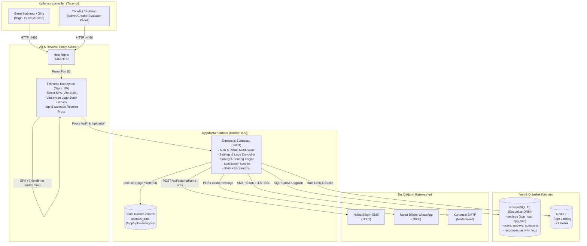
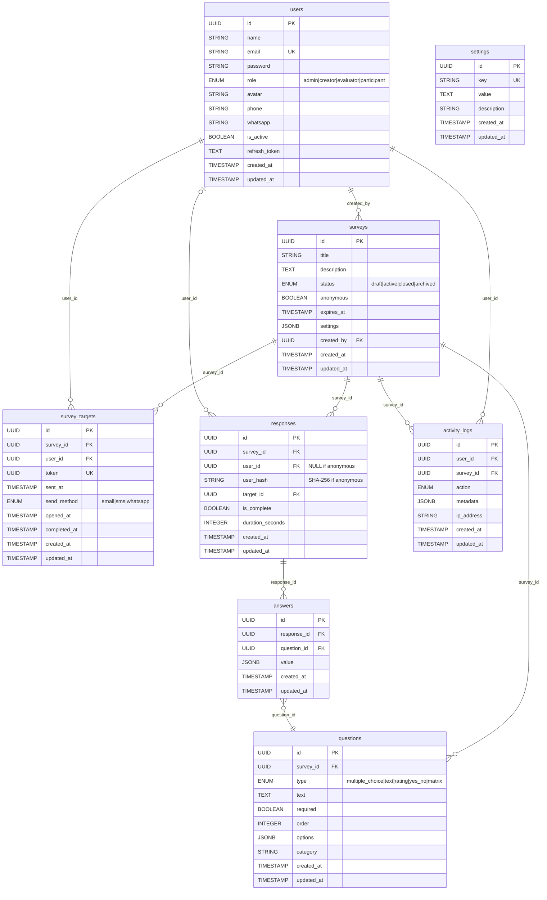

# Mimari — SurveyPro (Anket Yönetim Sistemi)

Tarih: 2026-09-19  
Sürüm: 1.1 (Kurumsal Marka ve Logo Yönetimi Dahil)  
Durum: ONAYLI  
Rol: Mimar  

---

## 1. Özet ve Kısıtlar

### 1.1 Amaç
SurveyPro, kurumların çalışanlarına, paydaşlarına ve müşterilerine yönelik anketleri tasarlamasını, çok kanallı bildirim (E-posta, SMS, WhatsApp) ile hedef kitleye ulaştırmasını, yanıtları puanlama ve kategori bazlı analiz modelleriyle gerçek zamanlı ölçümlemesini sağlayan kurumsal bir anket yönetim platformudur. 

Platform, kurumların kurumsal kimliklerini ve marka standartlarını sisteme yansıtabilmeleri için **Dinamik Kurumsal Marka ve Logo Yönetimi (White-Labeling)** modülünü barındırır. Bu modül sayesinde giriş ekranı (`/login`), yönetim paneli sol gezinme menüsü (`AppLayout` Sidebar) ve mobil üst başlık barı işletmenin kendi logosu ve sistem başlığı ile özelleştirilebilir; dilediğinde tek tıkla orijinal Truguard varsayılan logosuna geri dönülebilir.

### 1.2 Kısıtlar
| No | Kısıt | Açıklama |
|---|---|---|
| K-1 | Stack değişmez | Mevcut Node.js/Express + Sequelize + PostgreSQL 15 + React 18 (Vite) + Tailwind CSS + Redis 7 yığını korunur. |
| K-2 | Tek kiracı (Single-Tenant) | İlk sürüm tek organizasyon içindir; sistem geneli tek kurumsal logo ve marka başlığı geçerlidir. Çoklu kiracı (multi-tenant) logo ayrıştırması sonraki büyük sürüme bırakılmıştır. |
| K-3 | Port ve ağ mimarisi | Prod sunucuda (`185.126.217.99`) frontend `4466/TCP`, backend `5001/TCP` (yalnızca Docker iç ağ). Host Nginx 80/443 başka servislere ayrılmış olup yeni yayınlar TCP portu üzerinden karşılanır. |
| K-4 | Güvenlik standartları | Bcrypt (cost 12), JWT (15 dk Access + 7 gün Refresh), UUIDv4 token, rate limiting, Helmet güvenlik başlıkları ve RBAC zorunludur. |
| K-5 | KVKK & Gizlilik | Anonim anketlerde katılımcı kimlikleri SHA-256 hash ile gizlenir; açık metin PII yanıt kayıtlarıyla ilişkilendirilmez. |
| K-6 | Harici ağ servisleri | Nokta Bilişim SMS Gateway (`:3001`), Nokta Bilişim WhatsApp Gateway (`:3000`) ve kurumsal SMTP sunucusu. |
| K-7 | Excel/CSV dışa aktarım | `xlsx` kütüphanesi ile optimize bellek içi üretim; 50.000+ yanıt seviyesinde streaming Excel (`exceljs`) genişleme noktası mevcuttur. |
| K-8 | Dosya depolama ve logo kısıtları | Logo yükleme dosya boyutu maksimum 2MB; izin verilen MIME tipleri `image/png`, `image/jpeg`, `image/webp`, `image/svg+xml`. Logolar `/uploads/logos/` dizininde tekil UUID adlarıyla saklanır; kalıcı Docker volume (`uploads_data:/app/uploads`) zorunludur. |

### 1.3 Kapsam Dışı (Bu Sürümde Açıkça Yok)
1. **Anket İçi Dinamik Dal/Mantık (Skip Logic / Conditional Branching)**: Sorular sıra numarasına göre ardışık sunulur.
2. **3. Parti OAuth / SSO Entegrasyonu**: Google/Azure AD/LDAP girişi yoktur; yerel JWT e-posta/şifre kullanılır.
3. **Native Mobil Uygulama (iOS / Android)**: Mobil uyumlu (responsive web) SPA olarak çalışır.
4. **Çok Dilli Anket İçeriği (i18n)**: Sistem arayüzü ve formlar Türkçe odaklıdır.
5. **Kullanıcı/Departman Bazlı Çoklu Logo (Multi-Tenant White-Labeling)**: Her departmana ayrı tema/logo tanımlanamaz; yüklenen logo sistem geneli için tektir.
6. **Tarayıcı İçi Görsel Kırpıcı (Image Cropper)**: Görsel editörü yoktur; CSS oran koruma (`object-contain`) kurallarıyla ölçeklenir.
7. **Ödeme / Ücretli Anket Modülü**: Ticari ödeme altyapısı kapsam dışıdır.

---

## 2. Bileşen Diyagramı ve Sorumluluklar

### 2.1 Mermaid Mimari Diyagramı



### 2.2 Sorumluluk Tablosu

| Bileşen | Sorumluluk |
|---|---|
| **Host Nginx (:4466)** | Sunucu dışından gelen 4466 portundaki HTTP isteklerini karşılar ve Frontend konteynerine iletir; SSL sonlandırma noktasıdır. |
| **Frontend Konteyneri (Nginx :80)** | React SPA statik varlıklarını sunar, Gzip sıkıştırma uygular, `/api` ve `/uploads` isteklerini backend konteynerine proxy eder. |
| **React SPA (Vite)** | Yönetim paneli, anket editörü, analitik raporlama, oturum açma (`/login`), katılımcı arayüzü (`/survey/:token`), `brandingStore` ile dinamik logo/başlık yönetimi. |
| **Backend Express (:5001)** | JWT kimlik doğrulama, RBAC yetki denetimi, dosya yükleme (Multer), SVG XSS sanitizasyonu, genel ayarlar (`/api/settings/public`), bildirim gönderimi, Excel çıktısı üretimi. |
| **Kalıcı Volume (`uploads_data`)** | Yüklenen kurumsal logo dosyalarının (`/app/uploads/logos/`) konteyner yeniden başlatmalarında silinmesini önler. |
| **PostgreSQL 15** | İlişkisel veri, JSONB anket/soru yapıları, sistem ayarları (`app_logo`, `app_title`, SMTP, SMS, WA) ve denetim logları (`activity_logs`). |
| **Redis 7** | Endpoint rate limiting sayaçları ve önbellek katmanı. |
| **Nokta Bilişim SMS Gateway** | Katılımcılara SMS ile tekil token linki dağıtımı (`POST /api/external/send-sms`). |
| **Nokta Bilişim WhatsApp Gateway** | Katılımcılara WhatsApp üzerinden anket daveti dağıtımı (`POST /send-message`). |
| **Kurumsal SMTP (Nodemailer)** | Truguard kurumsal şablonlu e-posta davet gönderimi ve bağlantı testleri. |

---

## 3. Veri Modeli (Varlıklar, Alanlar, Tipler, İlişkiler, İndeksler, Silme Stratejisi)

### 3.1 Varlık İlişki Diyagramı (ERD)



### 3.2 `settings` Tablosu Anahtar ve Değer Şeması

`settings` tablosu anahtar-değer (Key-Value) modelinde çalışır. `key` kolonu tekildir (`UNIQUE`).

| Anahtar (`key`) | Tip | Varsayılan Değer | Açıklama | Görünürlük / Yetki |
|---|---|---|---|---|
| `app_logo` | TEXT | `""` (veya `null`) | Yüklenen özel logo dosyasının göreceli URL'si (Örn: `/uploads/logos/logo_d1e8...png`). Boş ise sistem varsayılan Truguard logosunu fallback kullanır. | Herkese Açık (`/public`) + Admin |
| `app_title` | STRING | `"SurveyPro"` | Uygulama ve sistem başlığı. Giriş sayfasında, sol menüde ve tarayıcı sekmesinde görüntülenir. | Herkese Açık (`/public`) + Admin |
| `site_url` | STRING | `"http://localhost:3000"` | E-posta, SMS ve WhatsApp bildirimlerindeki tekil anket linklerinin taban URL'si. | Herkese Açık (`/public`) + Admin |
| `smtp_host` | STRING | `"smtp.gmail.com"` | E-posta sunucu adresi. | Admin Only |
| `smtp_port` | STRING | `"587"` | E-posta sunucu portu. | Admin Only |
| `smtp_user` | STRING | `""` | SMTP kullanıcı adı / e-posta. | Admin Only |
| `smtp_pass` | STRING | `""` | SMTP parolası (API yanıtlarında `••••••••` maskeli). | Admin Only (Maskeli) |
| `smtp_ssl` | STRING | `"false"` | SSL/TLS (`true`/`false`). | Admin Only |
| `smtp_auth` | STRING | `"true"` | Kimlik doğrulama zorunlu mu. | Admin Only |
| `smtp_from_name` | STRING | `"SurveyPro"` | Gönderici adı. | Admin Only |
| `smtp_from_email` | STRING | `""` | Gönderici e-posta adresi. | Admin Only |
| `whatsapp_api_url`| STRING | `""` | Nokta Bilişim WhatsApp API uç noktası (`/send-message`). | Admin Only |
| `sms_api_url` | STRING | `""` | Nokta Bilişim SMS Gateway uç noktası (`/api/external/send-sms`). | Admin Only |
| `sms_api_key` | STRING | `""` | SMS Gateway API yetkilendirme anahtarı (API yanıtlarında `••••••••` maskeli). | Admin Only (Maskeli) |
| `sms_header` | STRING | `"NOKTABLSM"` | Operatör onaylı SMS başlığı (Header). | Admin Only |

### 3.3 JSONB Alan Yapıları

#### `questions.options` — Soru Tipine Göre
- **multiple_choice / yes_no:**
  ```json
  [
    { "text": "Kesinlikle Katılıyorum", "score": 5 },
    { "text": "Katılıyorum", "score": 4 },
    { "text": "Kararsızım", "score": 3 },
    { "text": "Katılmıyorum", "score": 2 },
    { "text": "Kesinlikle Katılmıyorum", "score": 1 }
  ]
  ```
- **rating:** `[]` *(Puan doğrudan 1-10 sayısal değeri olarak alınır.)*
- **matrix:**
  ```json
  {
    "rows": [
      { "text": "Liderlik ve Yönetim Becerisi" },
      { "text": "Zaman Yönetimi ve Planlama" }
    ],
    "columns": [
      { "text": "Çok İyi", "score": 5 },
      { "text": "İyi",    "score": 4 },
      { "text": "Orta",   "score": 3 },
      { "text": "Zayıf",  "score": 2 },
      { "text": "Yetersiz", "score": 1 }
    ]
  }
  ```

#### `answers.value` — Soru Tipine Göre
| Soru Tipi | `value` Tipi | Örnek |
|---|---|---|
| `multiple_choice` | `string[]` | `["Katılıyorum"]` |
| `yes_no` | `string[]` | `["Evet"]` |
| `rating` | `number` | `9` |
| `text` | `string` | `"Görüş ve öneri metni..."` |
| `matrix` | `object` (satır_indeksi → sütun_metni) | `{"0": "Çok İyi", "1": "İyi"}` |

### 3.4 İndeks Planı

| Tablo | Kolon(lar) | Tip | Gerekçe / Açıklama |
|---|---|---|---|
| `users` | `email` | UNIQUE | Hızlı login arama ve benzersizlik |
| `settings` | `key` | UNIQUE | Anahtar bazlı tekil ayar ve logo getirme (`O(1)` index seek) |
| `survey_targets` | `token` | UNIQUE | Katılımcı link doğrulama (`/survey/:token`) |
| `surveys` | `created_by`, `status` | B-Tree Bileşik | Creator filtreleme ve durum sorguları |
| `questions` | `survey_id`, `order` | B-Tree Bileşik | Sıralı anket soru listeleme |
| `survey_targets` | `survey_id`, `user_id` | B-Tree Bileşik | Mükerrer hedef denetimi |
| `responses` | `survey_id`, `is_complete` | B-Tree Bileşik | Analitik rapor hesaplama hızlandırma |
| `answers` | `response_id`, `question_id` | B-Tree Bileşik | Yanıt birleştirme sorguları |
| `activity_logs` | `user_id`, `created_at` | B-Tree Bileşik | Denetim izi sayfalama |

### 3.5 Silme Stratejisi

| Tablo / Varlık | Strateji | Açıklama |
|---|---|---|
| `settings.app_logo` | Özel Logo Sıfırlama (Reset) | `DELETE /api/settings/logo` çağrıldığında `app_logo` değeri DB'de `""` yapılır; diskteki `/uploads/logos/logo_*.ext` dosyası güvenli bir şekilde silinir. Sistem anında varsayılan Truguard logosuna döner. |
| `surveys` | Hard Delete + Cascade | Anket silinmeden önce `ActivityLog` kaydı atılır; ilişkili sorular, hedefler, yanıtlar ve cevaplar cascade silinir. Pasife alma için `status: 'archived'` önerilir. |
| `users` | Hard Delete | Admin yetkilidir. Kullanıcı kendi kendini silemez. Audit log kayıtları kullanıcı silinse de korunur (`constraints: false`). |
| `questions` | Hard Delete (Toplu) | Anket editöründe güncelleme yapıldığında mevcut sorular silinip güncel sıra ve seçeneklerle yeniden yazılır. |
| `activity_logs` | Hiçbir Zaman Silinmez | Yasal denetim ve kurumsal izlenebilirlik amacıyla append-only saklanır. |

---

## 4. API Sözleşmesi

Tüm API yanıtları standart zarf (envelope) yapısına tabidir:

```json
// Başarılı Yanıt (200 / 201):
{
  "success": true,
  "data": { ... }
}

// Hatalı Yanıt (400 / 401 / 403 / 404 / 429 / 500):
{
  "success": false,
  "message": "<Açıklayıcı Türkçe hata mesajı>"
}
```

Sayfalı yanıtlarda `data`: `{ rows: [...], total: number, page: number, limit: number }` formatındadır.

---

### 4.1 Sistem Ayarları ve Marka Yönetimi — `/api/settings`

| Uç Nokta | Metot | Yetki | Açıklama |
|---|---|---|---|
| `/settings/public` | GET | **Herkese Açık (No Auth)** | Giriş sayfası ve genel layout için logo URL, site başlığı ve site URL döner (< 100ms). |
| `/settings` | GET | Admin (`JWT`) | Tüm ayarları döner; `smtp_pass` ve `sms_api_key` maskelenir (`••••••••`). |
| `/settings` | PUT | Admin (`JWT`) | Sistem ayarlarını günceller (`app_title`, `site_url`, SMTP, SMS, WA). Maskeli gönderilen alanlar değiştirilmez. |
| `/settings/logo` | POST | Admin (`JWT`) | Özel logo yükler / günceller (max 2MB, PNG/JPG/WEBP/SVG). Disk temizliği yapar, `app_logo` kaydeder. |
| `/settings/logo` | DELETE | Admin (`JWT`) | Özel logoyu siler, diskteki dosyayı temizler ve varsayılan logoya döner. |
| `/settings/test-smtp` | POST | Admin (`JWT`) | Tanımlı SMTP sunucusuna canlı TCP/TLS el sıkışma testi yapar. |
| `/settings/send-test-email` | POST | Admin (`JWT`) | Girilen e-posta adresine örnek test e-postası gönderir. |
| `/settings/send-test-whatsapp` | POST | Admin (`JWT`) | Girilen telefon numarasına WhatsApp test mesajı gönderir. |
| `/settings/send-test-sms` | POST | Admin (`JWT`) | Girilen telefon numarasına SMS test mesajı gönderir. |

#### 4.1.1 `GET /api/settings/public` (AC-27)
- **Güvenlik**: Herkese Açık (Yetkilendirme gerektirmez). Rate limiting: max 60 istek/dk per IP.
- **Performans Hedefi**: < 100 ms yanıt süresi.
- **İstek Başlıkları**: `Accept: application/json`
- **Girdi Şeması**: Yok (Query / Body parametresi almaz).
- **Başarılı Yanıt (200 OK)**:
  ```json
  {
    "success": true,
    "data": {
      "app_logo": "/uploads/logos/logo_d1e89b62-6c3e-4b47-b89a-f4c2e6f498c1.png",
      "app_title": "SurveyPro",
      "site_url": "http://185.126.217.99:4466"
    }
  }
  ```
  *(Not: Özel logo yüklenmemişse `app_logo` değeri `null` veya `""` döner; istemci varsayılan Truguard logosunu fallback olarak gösterir.)*
- **Hata Durumları**:
  - `500 Internal Server Error`: `{"success": false, "message": "Genel ayarlar yüklenirken bir hata oluştu"}`

#### 4.1.2 `POST /api/settings/logo` (AC-23, AC-24)
- **Güvenlik**: JWT Kimlik Doğrulama + `admin` Rolü Zorunlu (`authenticate`, `authorize('admin')`).
- **İstek Formatı**: `multipart/form-data`
- **Girdi Şeması**:
  - `logo` (Zorunlu): İkili görsel dosyası (Binary File).
  - Dosya Boyutu Üst Sınırı: **2MB (2,097,152 Bayt)**.
  - İzin Verilen MIME Tipleri: `image/png`, `image/jpeg`, `image/webp`, `image/svg+xml`.
- **Sunucu İşlem Sırası**:
  1. Multer middleware ile dosya boyutu (≤2MB) ve MIME tipi kontrol edilir.
  2. Dosya adı tekil UUID formatında üretilir (`logo_<uuid>.<ext>`) ve `/app/uploads/logos/` dizinine yazılır.
  3. Eğer yüklenen dosya SVG ise, sunucu tarafında `<script>`, `onload`, `javascript:` gibi zararlı XSS etiket ve nitelikleri temizlenir (SVG Sanitization).
  4. Varsa sistemdeki eski özel logo dosyası diskten temizlenir (Garbage collection).
  5. `settings` tablosundaki `app_logo` kaydı yeni göreceli yol ile güncellenir.
  6. `activity_logs` tablosuna `setting_updated` aksiyonu ile audit log yazılır.
- **Başarılı Yanıt (200 OK)**:
  ```json
  {
    "success": true,
    "data": {
      "app_logo": "/uploads/logos/logo_d1e89b62-6c3e-4b47-b89a-f4c2e6f498c1.png",
      "app_title": "SurveyPro",
      "message": "Logo başarıyla yüklendi ve güncellendi"
    }
  }
  ```
- **Hata Durumları**:
  - `400 Bad Request`: `{"success": false, "message": "Geçersiz dosya formatı. Yalnızca PNG, JPG, JPEG, WebP ve SVG formatları desteklenir."}`
  - `400 Bad Request`: `{"success": false, "message": "Dosya boyutu 2MB'tan büyük olamaz."}`
  - `400 Bad Request`: `{"success": false, "message": "Lütfen bir logo dosyası seçin."}`
  - `401 Unauthorized`: `{"success": false, "message": "Oturum açmanız gerekmektedir"}`
  - `403 Forbidden`: `{"success": false, "message": "Bu işlem için admin yetkisi gereklidir"}`
  - `500 Internal Server Error`: `{"success": false, "message": "Logo kaydedilirken bir hata oluştu"}`

#### 4.1.3 `DELETE /api/settings/logo` (AC-24)
- **Güvenlik**: JWT Kimlik Doğrulama + `admin` Rolü Zorunlu.
- **Sunucu İşlem Sırası**:
  1. `settings` tablosundaki `app_logo` değeri okunur.
  2. Varsa diskteki ilgili dosya (`/app/uploads/logos/...`) silinir.
  3. `settings.app_logo` değeri `""` (boş string) olarak kaydedilir.
  4. `activity_logs` tablosuna `setting_updated` aksiyonu ile log atılır.
- **Başarılı Yanıt (200 OK)**:
  ```json
  {
    "success": true,
    "data": {
      "app_logo": null,
      "message": "Özel logo kaldırıldı, sistem varsayılan Truguard logosuna sıfırlandı"
    }
  }
  ```
- **Hata Durumları**:
  - `401 Unauthorized`: `{"success": false, "message": "Oturum açmanız gerekmektedir"}`
  - `403 Forbidden`: `{"success": false, "message": "Bu işlem için admin yetkisi gereklidir"}`
  - `500 Internal Server Error`: `{"success": false, "message": "Logo sıfırlanırken bir hata oluştu"}`

---

### 4.2 Kimlik Doğrulama — `/api/auth`

| Uç Nokta | Metot | Giriş Şeması | Çıktı Şeması | Yetki | Hata Kodları |
|---|---|---|---|---|---|
| `/auth/login` | POST | `{ email: string, password: string }` | `{ user, accessToken, refreshToken }` | Public (loginLimiter: max 5/dk) | 400, 401, 429 |
| `/auth/register` | POST | `{ name, email, password, role? }` | `{ user, accessToken, refreshToken }` | Public | 400 |
| `/auth/refresh` | POST | `{ refreshToken: string }` | `{ accessToken, refreshToken }` | Public | 401 |
| `/auth/logout` | POST | — | `{ message }` | JWT Gerekli | 401 |
| `/auth/me` | GET | — | `User` (şifresiz) | JWT Gerekli | 401 |

---

### 4.3 Anket Yönetimi — `/api/surveys`

Tüm uçlar JWT gerektirir.

| Uç Nokta | Metot | Giriş Şeması | Çıktı Şeması | Yetki | Hata Kodları |
|---|---|---|---|---|---|
| `/surveys` | GET | — | `Survey[]` | Tüm Roller (Filtreli) | 401 |
| `/surveys` | POST | `{ title, description?, anonymous?, expires_at?, questions[] }` | `Survey` + sorular | admin, creator | 400, 401, 403 |
| `/surveys/:id` | GET | — | `Survey` + sorular + creator | Tüm Roller | 404, 401 |
| `/surveys/:id` | PUT | `{ title?, description?, anonymous?, expires_at?, questions[] }` | `Survey` güncel | admin, creator (kendi) | 403, 404 |
| `/surveys/:id` | DELETE | — | `{ message }` | admin, creator (kendi) | 403, 404 |
| `/surveys/:id/send`| POST | `{ userIds: UUID[], method: "email"|"sms"|"whatsapp" }` | `{ sent, failed[], message }` | admin, creator | 400, 404, 429 |
| `/surveys/:id/report` | GET | — | Analitik metrikler, kategori barları, kişi puanları | admin, creator, evaluator | 404 |
| `/surveys/:id/export-excel` | GET | — | Binary blob (`.xlsx`) | admin, creator, evaluator | 404 |
| `/surveys/:id/status` | PATCH | `{ status: "draft"|"active"|"closed"|"archived" }` | `Survey` güncel | admin, creator | 404 |

---

### 4.4 Katılımcı Yanıtlama (Public) — `/api/responses`

| Uç Nokta | Metot | Giriş Şeması | Çıktı Şeması | Yetki | Hata Kodları |
|---|---|---|---|---|---|
| `/responses/token/:token` | GET | — | `{ survey, targetId }` | Public (Token ile) | 400 (Dolduruldu/Süresi doldu/Pasif), 404 |
| `/responses/token/:token` | POST | `{ answers: [{question_id, value}], duration_seconds: int }` | `{ message: "Anket yanıtlarınız kaydedildi" }` | Public (Token ile) | 400 (Mükerrer gönderim engeli), 404 |

---

### 4.5 Kullanıcı ve Aktivite Yönetimi — `/api/users`, `/api/logs`, `/api/health`

| Uç Nokta | Metot | Giriş | Çıktı | Yetki |
|---|---|---|---|---|
| `/users` | GET | — | `User[]` | admin |
| `/users` | POST | `{ name, email, password?, role, phone?, whatsapp? }` | `User` | admin |
| `/users/import` | POST | multipart (file: xlsx/csv, max 5MB) | `{ created, skipped, errors[] }` | admin |
| `/users/:id` | PUT | `{ name?, role?, phone?, whatsapp?, is_active?, password? }`| `User` | admin |
| `/users/:id` | DELETE | — | `{ message }` | admin |
| `/logs` | GET | `?page&limit&action&userId` | `{ rows, total, page }` | admin |
| `/logs/stats` | GET | — | Dashboard istatistikleri | JWT Gerekli |
| `/health` | GET | — | `{ status: "ok", time: ISO-8601 }` | Public |

---

## 5. Güvenlik Tasarımı

### 5.1 Kimlik Doğrulama ve Yetki Modeli (RBAC)

```
İstemci İsteği ──> [Bearer Access Token] ──> authenticate() ──> req.user
                                                                  │
                                            authorize('admin') ───┘
                                                │
                                                ▼ (Yetki Var)
                                            Controller & İş Mantığı
```

- **Admin Rolü**: Sistem ayarlarını (`/settings`), marka/logo yönetimini (`/settings/logo`), kullanıcıları ve tüm audit logları yönetebilen tek roldür.
- **Creator Rolü**: Soru ve anket tasarlar, dağıtır ve kendi anketlerinin raporlarını inceler.
- **Evaluator Rolü**: Yalnızca anket raporlarını, kategori başarılarını ve katılımcı puanlarını salt-okunur inceler.
- **Participant Rolü**: Token tabanlı anket doldurur veya "Anketlerim" sekmesinden kendisine atanan anketleri görür.

### 5.2 STRIDE Tehdit Modeli Özeti (Logo & Ayarlar Odaklı)

| Tehdit (STRIDE) | Saldırı Vektörü | Mimari Savunma Mekanizması |
|---|---|---|
| **Spoofing** (Kimliğe Bürünme) | Giriş ekranında kurumsal logoyu yanıltıcı değiştirme | Logo yükleme ve silme yalnızca geçerli `admin` JWT oturumu ile yapılabilir. |
| **Tampering** (Veri Tahrifatı) | Yüklenen görsel dosyasına zararlı script/PHP enjeksiyonu | Yüklenen dosya asla doğrudan çalıştırılmaz (`nosniff`). Dosya uzantısı/MIME katı beyaz listeye (`png/jpg/webp/svg`) tabidir. SVG dosyaları sunucuda XSS öğelerinden arındırılır. |
| **Repudiation** (İnkâr) | Yöneticinin logoyu silip/değiştirip inkar etmesi | Logo yükleme ve silme işlemleri `ActivityLog` tablosuna yönetici ID'si, IP adresi ve eski/yeni dosya bilgisiyle kaydedilir. |
| **Information Disclosure** (Bilgi Sızması) | `/api/settings/public` üzerinden SMTP şifrelerinin veya SMS API key'lerinin okunması | `getPublicSettings` controller'ı yalnızca `['app_logo', 'app_title', 'site_url']` alanlarını döndürür; hassas veriler veritabanı sorgu katmanında filtrelenir. |
| **Denial of Service** (Hizmet Engelleme) | Dev görsel dosyaları yükleyerek disk/RAM tüketimi veya public ucu bombardımana tutma | Multer katmanında 2MB katı sınır (`fileSize: 2097152`), `apiLimiter` (100/dk) ve `publicSettingsLimiter` (60/dk) devrededir. |
| **Elevation of Privilege** (Yetki Yükseltme) | Katılımcı veya Creator rolünün logo yükleme ucu çağırması | `authorize('admin')` middleware katmanı 403 Forbidden ile isteği engeller. |

### 5.3 Dosya Yükleme ve SVG XSS Güvenlik Standardı

1. **Çok Katmanlı MIME ve Uzantı Doğrulaması**:
   - İstemci tarafı: `<input type="file" accept=".png,.jpg,.jpeg,.svg,.webp" />` ve dosya boyutu kontrolü.
   - Sunucu tarafı: Multer `fileFilter` ile `file.mimetype` doğrulaması (`image/png`, `image/jpeg`, `image/webp`, `image/svg+xml`).
2. **Tekil İsimlendirme ve Dizin İzolasyonu**:
   - Yüklenen dosyalar istemcinin gönderdiği isimle kaydedilmez; `logo_${crypto.randomUUID()}.${ext}` formatında isimlendirilir.
   - Dosyalar `/app/uploads/logos/` izole klasöründe tutulur. Dizin dışına çıkma (`../` path traversal) engellenmiştir.
3. **SVG Sanitizasyonu (AC-23, R-5)**:
   - SVG dosyaları metin/XML tabanlı olduğundan zararlı JavaScript (`<script>`, `<a xlink:href="javascript:...">`, `onload=...`) barındırabilir.
   - Sunucu tarafında SVG içeriği temizlenir: `<script>`, `<iframe>`, `<object>`, `<embed>`, `<foreignObject>` etiketleri ve `on*` nitelikleri regex/parser ile ayıklanır.
   - Frontend tarafında SVG'ler hiçbir zaman `dangerouslySetInnerHTML` ile doğrudan DOM'a basılmaz; daima izole `` etiketi ile render edilir. Bu sayede tarayıcı görsel sandbox kuralları işletilir.
4. **Statik Dosya Sunumu Güvenlik Başlıkları**:
   - Nginx ve Express `/uploads` rotasında `X-Content-Type-Options: nosniff` başlığı zorunludur.

---

## 6. Dosya / Klasör Planı ve Frontend Mimarisi

### 6.1 Dosya Yapısı Planı

```
/opt/anket/  (Proje Kök Dizini)
├── backend/
│   ├── src/
│   │   ├── app.js                          — [GÜNCELLENECEK] /uploads statik dosya sunumu eklenecek
│   │   ├── config/database.js
│   │   ├── controllers/
│   │   │   ├── settingsController.js       — [GÜNCELLENECEK] getPublic, uploadLogo, deleteLogo eklenecek
│   │   │   ├── authController.js
│   │   │   ├── surveyController.js
│   │   │   └── logController.js
│   │   ├── middleware/
│   │   │   ├── upload.js                   — [YENİ] Multer 2MB logo upload & MIME doğrulama middleware'i
│   │   │   ├── auth.js
│   │   │   └── rateLimiter.js              — [GÜNCELLENECEK] publicSettingsLimiter eklenecek
│   │   ├── routes/
│   │   │   ├── settingsRoutes.js           — [GÜNCELLENECEK] /public, /logo (POST/DELETE) rotaları eklenecek
│   │   │   └── index.js
│   │   ├── services/
│   │   │   └── settingsService.js          — [GÜNCELLENECEK] app_logo, app_title varsayılanları ve logo silme
│   │   ├── utils/
│   │   │   ├── svgSanitizer.js             — [YENİ] Sunucu tarafı SVG XSS temizleyici
│   │   │   ├── validate.js
│   │   │   └── response.js
│   │   └── database/
│   │       └── seed.js                     — [GÜNCELLENECEK] app_logo ve app_title varsayılan tohum kaydı
│   └── uploads/
│       └── logos/                          — [YENİ] Yüklenen logoların kaydedileceği kalıcı dizin
│
├── frontend/
│   ├── src/
│   │   ├── App.jsx                         — [GÜNCELLENECEK] Uygulama bootstrap'inde fetchBranding() çağrısı
│   │   ├── store/
│   │   │   ├── brandingStore.js            — [YENİ] Zustand store: appLogo, appTitle, siteUrl, fetch/set/reset
│   │   │   ├── authStore.js
│   │   │   └── notificationStore.js
│   │   ├── pages/
│   │   │   ├── LoginPage.jsx               — [GÜNCELLENECEK] Dinamik logo & sistem başlığı + Truguard fallback
│   │   │   ├── SettingsPage.jsx            — [GÜNCELLENECEK] "Kurumsal Marka ve Logo Yönetimi" bölümü
│   │   │   └── DashboardPage.jsx
│   │   ├── components/
│   │   │   └── layout/
│   │   │       └── AppLayout.jsx           — [GÜNCELLENECEK] Sidebar (max 48px) ve mobil header (max 36px) logo
│   │   └── utils/
│   │       └── api.js                      — [GÜNCELLENECEK] getPublicSettings, uploadLogo, deleteLogo API çağrıları
│
├── docker/
│   ├── nginx.prod.conf                     — [GÜNCELLENECEK] /uploads proxy ve static cache kuralları
│   ├── Dockerfile.backend                  — [GÜNCELLENECEK] /app/uploads klasör izni
│   └── Dockerfile.frontend.prod
│
├── docker-compose.yml                      — [GÜNCELLENECEK] uploads_data volume tanımlaması
├── docker-compose.prod.yml                 — [GÜNCELLENECEK] uploads_data volume tanımlaması
├── docs/
│   ├── gereksinimler.md
│   ├── mimari.md                           — Bu doküman
│   ├── tasarim-kontrol.md                  — Güncellenen kontrol listesi kararları
│   └── adr/
│       └── 0005-kurumsal-marka-ve-dinamik-logo-yonetimi.md
```

### 6.2 Frontend Durum Yönetimi: `brandingStore.js`

```javascript
// frontend/src/store/brandingStore.js (Mimari Tasarım Sözleşmesi)
import { create } from 'zustand';
import api from '../utils/api';

export const useBrandingStore = create((set, get) => ({
  appLogo: null,             // Özel logo URL'si veya null (null ise fallback Truguard)
  appTitle: 'SurveyPro',     // Kurumsal sistem başlığı
  siteUrl: '',               // Site URL
  loading: false,
  error: null,

  // Uygulama ayağa kalktığında /api/settings/public ucundan bilgileri çeker
  fetchBranding: async () => {
    set({ loading: true });
    try {
      const res = await api.get('/settings/public');
      const data = res.data?.data || {};
      set({
        appLogo: data.app_logo || null,
        appTitle: data.app_title || 'SurveyPro',
        siteUrl: data.site_url || '',
        loading: false,
      });
    } catch (err) {
      // Hata durumunda varsayılan değerler korunur, kullanıcı akışı kesilmez
      set({ loading: false, error: err.message });
    }
  },

  // Logo yüklendiğinde anında state'i günceller (cache busting ile)
  setBranding: ({ app_logo, app_title }) => {
    set((state) => ({
      appLogo: app_logo !== undefined ? app_logo : state.appLogo,
      appTitle: app_title !== undefined ? app_title : state.appTitle,
    }));
  },

  // Özel logoyu sıfırlar
  resetLogo: () => {
    set({ appLogo: null });
  }
}));
```

### 6.3 Sayfa ve Bileşen Entegrasyon Detayları

#### 1. `LoginPage.jsx` (AC-25)
- Giriş ekranında `useBrandingStore`'dan `appLogo` ve `appTitle` okunur.
- Render mantığı:
  ```jsx
  <div className="flex justify-center mb-4">
     { e.currentTarget.src = truguardLogo; }} // Kırık görsel koruması
    />
  </div>
  <p className="text-white/60 mt-2 text-sm text-center">{appTitle || 'Anket Yönetim Sistemi'}</p>
  ```

#### 2. `AppLayout.jsx` (AC-26)
- **Masaüstü Sol Kenar Çubuğu (Sidebar)**:
  - Maksimum yükseklik: `48px` (`max-h-12`). Genişlik taşması engelli (`max-w-[180px] object-contain`).
  - Eğer `appLogo` tanımlıysa logo gösterilir; altında veya yanında `appTitle` ve kullanıcı rolü yer alır.
- **Mobil Üst Başlık Barı (Mobile Header)**:
  - Maksimum yükseklik: `36px` (`max-h-9`). Genişlik: `max-w-[120px] object-contain`.
  - Hamburger menü ikonunun hemen yanında kurumsal logo veya başlık hizalanır.

#### 3. `SettingsPage.jsx` — Marka & Logo Yönetimi Bölümü (AC-23, AC-24)
- **Bileşen Yapısı**:
  1. **Sistem Başlığı Girdisi (`app_title`)**: Form kaydetme butonuna bağlıdır.
  2. **Logo Yükleme Alanı (Dropzone & File Input)**:
     - Sürükle-bırak veya dosya seçme butonu.
     - Desteklenen formatlar (`.png, .jpg, .jpeg, .svg, .webp`) ve `Maks. 2MB` bilgi etiketi.
  3. **Canlı Görsel Önizleme Kartı (Live Preview)**:
     - Seçilen yeni görselin (veya mevcut yüklü logonun) açık ve koyu arka plan üzerinde önizlemesi.
  4. **Aksiyon Butonları**:
     - `[Logoyu Yükle / Değiştir]` (Mavi/İndigo buton, loading spinner'lı).
     - `[Varsayılana Dön (Sıfırla)]` (Kırmızı/Gri buton, özel logo varsa aktif; onay dialogu ile `DELETE /api/settings/logo` çağırır).
  5. **İstemci Tarafı Doğrulama**: 2MB'tan büyük dosya veya geçersiz uzantı seçildiğinde sunucuya gitmeden anında kırmızı toast uyarısı (`add('Dosya boyutu 2MB'tan büyük olamaz', 'error')`).

---

## 7. Performans ve Ölçek Kararları

### 7.1 Önbellek ve Hızlı Yanıt Mimarisi

| Kaynak / Uç | Hedef Süre | Önbellek & Optimizasyon Stratejisi |
|---|---|---|
| `GET /api/settings/public` | **< 100 ms** (AC-27) | `Setting.findAll({ where: { key: ['app_logo', 'app_title', 'site_url'] } })` tek sorgusu; memory map TTL desteği. |
| Statik Logo Dosyaları (`/uploads/logos/*`) | **< 50 ms** (Tarayıcı Cache) | Nginx seviyesinde `Cache-Control: public, max-age=86400` (1 gün) başlığı. |
| Cache Busting | Anında Güncelleme | Logo güncellendiğinde frontend store `?v=${Date.now()}` parametresi ekleyerek tarayıcı önbelleğini anında tazeler. |
| Raporlama API (`/api/surveys/:id/report`) | **< 1000 ms** (AC-19) | Redis önbellek genişleme noktası (`survey:${id}:report`, 5 dk TTL). |

### 7.2 Disk ve Bellek Yönetimi
- Logo dosyaları sunucuda doğrudan bellekte tutulmaz; Multer diskStorage ile doğrudan `/app/uploads/logos/` dizinine yazılır.
- Yeni bir logo yüklendiğinde veya "Varsayılana Dön" tıklandığında eski dosya `fs.promises.unlink` ile diskten silinir; sunucuda yetim dosya (garbage file) birikmesi önlenir.

---

## 8. Operasyon, Dağıtım ve Gözlemlenebilirlik

### 8.1 Kalıcı Volume ve Docker Yapılandırması

Logo dosyalarının konteyner yeniden kurulumlarında (`deploy.sh` veya `docker compose down && docker compose up`) silinmemesi için kalıcı Docker volume gereklidir.

**`docker-compose.prod.yml` Güncellemesi:**
```yaml
services:
  backend:
    volumes:
      - uploads_data:/app/uploads
    environment:
      - UPLOAD_DIR=/app/uploads/logos
      - MAX_LOGO_SIZE_MB=2

  frontend:
    # Nginx /uploads isteklerini backend'e proxy eder

volumes:
  postgres_data:
  uploads_data:   # Kalıcı kurumsal logo ve dosya depolama volume'ü
```

**`docker/nginx.prod.conf` Proxy Güncellemesi:**
```nginx
# Yüklenen logolar ve statik medya dosyaları
location /uploads/ {
    proxy_pass         http://backend:5001/uploads/;
    proxy_http_version 1.1;
    proxy_set_header   Host $host;
    add_header         Cache-Control "public, max-age=86400";
    add_header         X-Content-Type-Options "nosniff";
}
```

### 8.2 Ortam Değişkenleri (Config / Env)

| Değişken Adı | Varsayılan Değer | Açıklama |
|---|---|---|
| `UPLOAD_DIR` | `./uploads/logos` (veya `/app/uploads/logos`) | Yüklenen logoların yazılacağı mutlak/göreceli dizin yolu. |
| `MAX_LOGO_SIZE_MB` | `2` | İzin verilen maksimum logo dosya boyutu (MB). |
| `FRONTEND_URL` | `http://localhost:3000` | CORS ve anket linki taban adresi. |

### 8.3 Denetim İzi (Audit Log) Aksiyonları

Logo ve marka işlemlerinde `activity_logs` tablosuna yazılan aksiyonlar:
- `setting_updated`: Logo yüklendiğinde (`metadata: { field: 'app_logo', filename: 'logo_...png', app_title: '...' }`).
- `setting_updated`: Varsayılana sıfırlandığında (`metadata: { action: 'logo_reset_to_default' }`).

---

## 9. Test Stratejisi

### 9.1 Kabul Kriterleri (AC) ve Test Seviyeleri

| AC No | Kabul Kriteri Açıklaması | Test Seviyesi | Test Yöntemi & Senaryosu |
|---|---|---|---|
| **AC-1** | Başlık zorunlu anket oluşturma | Entegrasyon | `POST /api/surveys` `title=""` → `400 Bad Request` |
| **AC-2** | Soru sürükle-bırak sıralama | E2E | Drag & Drop sonrası sıra indekslerinin DB'ye 0..N yazımı |
| **AC-3** | Maksimum anket puanı canlı hesap | Birim / E2E | `calcMaxScore(questions)` fonksiyon testi |
| **AC-4** | Matris satır/sütun önizleme | E2E | Editörde matris boyutu değişiminde anlık DOM doğrulaması |
| **AC-5** | Kategori otomatik tamamlama | E2E | Soru kategorisi girerken `<datalist>` öneri testi |
| **AC-6** | Tekil UUIDv4 hedefleme token'ı | Entegrasyon | `POST /api/surveys/:id/send` sonrası `survey_targets.token` UUID format testi |
| **AC-7** | Truguard logolu duyarlı e-posta | Entegrasyon | Mock SMTP ile HTML e-posta gövdesinde logo ve link testi |
| **AC-8** | SMS telefon no normalizasyonu | Birim | `normalizePhone('+90 (532) 123-4567')` → `'5321234567'` |
| **AC-9** | WhatsApp mesaj içeriği | Entegrasyon | Mock WhatsApp gateway ile başlık/link format testi |
| **AC-10** | Test bildirimleri yeşil toast (<3s)| E2E | Ayarlar ekranından test e-posta/SMS/WA gönderimi toast testi |
| **AC-11** | Hassas ayar alanları maskeleme | Entegrasyon | `GET /api/settings` → `smtp_pass === '••••••••'` |
| **AC-12** | İlk açılışta `opened_at` kaydı | Entegrasyon | `GET /responses/token/:token` → `opened_at !== null` |
| **AC-13** | 20'şerli soru sayfalama | E2E | 21 soruluk ankette 2 sayfa ve zorunlu alan engeli testi |
| **AC-14** | Matris eksik satır uyarısı | E2E | Eksik satır bırakıldığında sayfa ilerleme engeli |
| **AC-15** | Mükerrer anket yanıt engeli | Entegrasyon | Tamamlanmış token ile `POST /responses/token/:token` → `400` |
| **AC-16** | Süresi dolmuş/pasif anket engeli| Entegrasyon | `expires_at < now` anket formuna erişim engeli |
| **AC-17** | Anonim anket SHA-256 hash | Entegrasyon | Anonim ankette `user_id === null` ve `user_hash` doğrulaması |
| **AC-18** | Tamamlanma süresi kaydı | Entegrasyon | `duration_seconds` tamsayı saniye kaydı testi |
| **AC-19** | Rapor yüklenme süresi (<1s) | Entegrasyon | 1.000 yanıtta `GET /surveys/:id/report` SLA testi |
| **AC-20** | Kategori renkli yüzde barları | E2E | ≥75% yeşil, ≥50% sarı, <50% kırmızı CSS kontrolü |
| **AC-21** | Katılımcı madalya sıralaması | E2E | Kişi Puanları sekmesinde 🥇🥈🥉 ikonları |
| **AC-22** | Excel export UTF-8 Türkçe uyumu| Entegrasyon | İndirilen `.xlsx` dosyasında Türkçe karakter doğrulaması |
| **AC-23** | **Logo format & 2MB boyut denetimi** | **Entegrasyon / Birim** | `POST /api/settings/logo` ile 3MB dosya veya `.exe` gönderildiğinde `400 Bad Request` dönmesi; PNG/JPG/SVG'nin başarılı geçmesi. |
| **AC-24** | **Canlı önizleme & Varsayılana dön** | **E2E / Entegrasyon** | `POST /api/settings/logo` sonrası canlı URL dönmesi; `DELETE /api/settings/logo` sonrası veritabanındaki `app_logo` alanının temizlenmesi ve sistemin Truguard fallback'e dönmesi. |
| **AC-25** | **Giriş ekranı dinamik logo gösterimi**| **E2E** | `/login` sayfasında yüklenen logonun ortalanmış görüntülenmesi; logo yoksa Truguard logosunun kesintisiz gösterilmesi. |
| **AC-26** | **Sidebar (48px) & Mobil (36px) logo**| **E2E** | `AppLayout` masaüstü kenar çubuğunda max-h 48px, mobil üst barda max-h 36px boyut sınırlarına ve responsive yapıya uyum testi. |
| **AC-27** | **Public Settings API (<100ms)** | **Entegrasyon (Perf/Sec)**| `GET /api/settings/public` uç noktasının auth gerektirmeden `<100ms` sürede yalnızca `{ app_logo, app_title, site_url }` dönmesi; şifre/key sızdırmadığının kanıtlanması. |

### 9.2 Test Komutları

```bash
# Backend birim ve API entegrasyon testleri (Logo, Auth, Settings, Anketler)
cd backend && npm test

# Belirli bir AC entegrasyon testi
cd backend && npx jest tests/settings.test.js

# Frontend testleri ve type-check
cd frontend && npm test

# Playwright E2E Kullanıcı Yolculuğu ve Görsel Testler
cd e2e && npx playwright test

# Güvenlik ve Bağımlılık Taraması
cd backend && npm audit --audit-level=high
cd frontend && npm audit --audit-level=high
```

---

## 10. Görev Paketleri ve Atama

| Paket No | Görev Paketi Tanımı | Sorumlu Ajan | Bağımlı Olduğu | Paralel Yapılabilir mi? |
|---|---|---|---|---|
| **P-01** | **DB Şema & Seed Hazırlığı**: `settings` tablosu `app_logo`, `app_title` varsayılanları, `scripts/init.sql` indeksleri ve seed güncellemesi. | **dba** | — | **Evet** |
| **P-02** | **Backend Logo & Public API**: `POST /api/settings/logo` (Multer 2MB, MIME kontrol, SVG sanitization, UUID dosya adı, eski logo temizleme), `DELETE /api/settings/logo`, `GET /api/settings/public` uçlarının yazılması. | **backend-dev** | P-01 | **Evet** (P-01 biter bitmez) |
| **P-03** | **Frontend Branding Store & Bootstrap**: `brandingStore.js` (Zustand) oluşturulması, `App.jsx` içinde uygulama başlangıcında `fetchBranding` tetiklenmesi, `api.js` yardımcıları. | **frontend-dev** | — | **Evet** (P-02 ile paralel başlar) |
| **P-04** | **Frontend UI Entegrasyonu**: `LoginPage.jsx` dinamik logo/başlık/fallback, `AppLayout.jsx` masaüstü (48px) ve mobil (36px) logo yerleşimi. | **frontend-dev** | P-03 | **Evet** (P-03 sonrası) |
| **P-05** | **Settings Marka & Logo Yönetim Ekranı**: `SettingsPage.jsx` içerisine "Kurumsal Marka ve Logo Yönetimi" bölümü (canlı önizleme, dropzone, dosya doğrulama, varsayılana dön butonu). | **frontend-dev** | P-03, P-04 | **Hayır** (P-04 sonrası) |
| **P-06** | **Docker & Nginx Statik Proxy Yapılandırması**: `docker-compose.prod.yml`, `docker-compose.yml` üzerinde `uploads_data` volume tanımlaması; `nginx.prod.conf` içine `/uploads/` proxy ve caching kurallarının eklenmesi. | **devops** | — | **Evet** (P-01..P-05 ile paralel) |
| **P-07** | **AppSec & SVG Güvenlik Denetimi**: SVG XSS enjeksiyon testleri, MIME sniffing koruması, 2MB dosya boyutu bypass denemeleri, Public API veri sızıntı denetimi. | **guvenlik** | P-02, P-05 | **Hayır** (Kodlama tamamlanınca) |
| **P-08** | **QA & Kabul Kriterleri (AC-1..AC-27) Doğrulaması**: Tüm 27 kabul kriterinin otomatik ve manuel test senaryolarıyla doğrulanması; regression testi. | **qa-denetci** | P-07 | **Hayır** (Güvenlik sonrası) |
| **P-09** | **Sayfa & Arayüz Akış Testi**: Tüm sayfalarda konsol hatası, kırık görsel (fallback) ve responsive yerleşim denetimi. | **test-operatoru**| P-08 | **Hayır** (QA sonrası) |
| **P-10** | **Dokümantasyon Güncellemesi**: `README.md`, `docs/api.md`, `CHANGELOG.md` güncellenmesi. | **teknik-yazar** | P-08 | **Evet** (P-08 ile eşzamanlı) |

### Bağımlılık ve Paralellik Grafiği

```
P-01 (DBA: Şema & Seed) ───────┐
                               ├──> P-02 (Backend API & Multer) ───┐
P-03 (Frontend: Branding Store) ─┴──> P-04 (Frontend: Layout/Login) ──┼──> P-05 (Settings Marka UI)
                                                                    │
P-06 (DevOps: Docker Volume & Nginx Proxy) ─────────────────────────┤
                                                                    ▼
                                                            P-07 (AppSec Güvenlik)
                                                                    │
                                                                    ▼
                                                            P-08 (QA & DoD Denetimi) ──> P-10 (Dokümantasyon)
                                                                    │
                                                                    ▼
                                                            P-09 (Test Operatörü Tarama)
```

---

## 11. Kabul Kriterleri Eşlemesi (AC-n → Bileşen/Uç)

| AC No | Kullanıcı Hikâyesi | Sorumlu Bileşen & Uç Nokta | Test ve Kanıt Seviyesi |
|---|---|---|---|
| **AC-1** | US-1 (Anket Tasarımı) | `POST /api/surveys` → `surveyController.create` | Entegrasyon Testi |
| **AC-2** | US-1 (Anket Tasarımı) | `EditSurveyPage.jsx` Drag & Drop → `PUT /api/surveys/:id` | E2E Testi |
| **AC-3** | US-1 (Anket Tasarımı) | `CreateSurveyPage.jsx` / `EditSurveyPage.jsx` Maks. Puan Kartı | Birim + E2E Testi |
| **AC-4** | US-1 (Anket Tasarımı) | `CreateSurveyPage.jsx` Matris Tablo Önizleme Bileşeni | E2E Testi |
| **AC-5** | US-1 (Anket Tasarımı) | `CreateSurveyPage.jsx` `<datalist>` Kategori Bileşeni | E2E Testi |
| **AC-6** | US-2 (Çok Kanallı Dağıtım) | `POST /api/surveys/:id/send` → `SurveyTarget.create/update` | Entegrasyon Testi |
| **AC-7** | US-2 (Çok Kanallı Dağıtım) | `notificationService.js` `sendEmail()` HTML Şablonu | Entegrasyon Testi |
| **AC-8** | US-2 (Çok Kanallı Dağıtım) | `notificationService.js` `sendSmsHttp()` Normalizasyon | Birim Testi |
| **AC-9** | US-2 (Çok Kanallı Dağıtım) | `notificationService.js` `sendWhatsAppHttp()` Format | Entegrasyon Testi |
| **AC-10** | US-3 (Entegrasyon Yönetimi) | `SettingsPage.jsx` Test Butonları → `/api/settings/send-test-*` | E2E Testi |
| **AC-11** | US-3 (Entegrasyon Yönetimi) | `GET /api/settings` → `settingsController.get` Maskeleme | Entegrasyon Testi |
| **AC-12** | US-4 (Anket Doldurma) | `GET /responses/token/:token` → `target.update({ opened_at })` | Entegrasyon Testi |
| **AC-13** | US-4 (Anket Doldurma) | `TakeSurveyPage.jsx` 20'şerli Sayfalama ve Validasyon Mantığı | E2E Testi |
| **AC-14** | US-4 (Anket Doldurma) | `TakeSurveyPage.jsx` Matris Satır Kontrolü ve Uyarı Bannerı | E2E Testi |
| **AC-15** | US-4 (Anket Doldurma) | `POST /responses/token/:token` Mükerrer Kontrolü (`completed_at`) | Entegrasyon Testi |
| **AC-16** | US-4 (Anket Doldurma) | `GET /responses/token/:token` `expires_at` ve `status` Denetimi | Entegrasyon Testi |
| **AC-17** | US-4 (Anket Doldurma) | `responseController.submit` Anonim SHA-256 Hash Mantığı | Entegrasyon Testi |
| **AC-18** | US-4 (Anket Doldurma) | `responseController.submit` `duration_seconds` Hesaplama | Entegrasyon Testi |
| **AC-19** | US-5 (Raporlama & Analitik) | `GET /api/surveys/:id/report` (Yanıt süresi < 1 sn) | Entegrasyon (Perf) |
| **AC-20** | US-5 (Raporlama & Analitik) | `ReportPage.jsx` Kategori Sekmesi Yüzde Barları ve Renkleri | E2E Testi |
| **AC-21** | US-5 (Raporlama & Analitik) | `ReportPage.jsx` Kişi Puanları 🥇🥈🥉 Madalya Sıralaması | E2E Testi |
| **AC-22** | US-5 (Raporlama & Analitik) | `GET /api/surveys/:id/export-excel` UTF-8 `.xlsx` Üretimi | Entegrasyon Testi |
| **AC-23** | **US-7 (Marka & Logo Yönetimi)**| `POST /api/settings/logo` + Multer 2MB + MIME + SVG Sanitizer | **Entegrasyon + Birim** |
| **AC-24** | **US-7 (Marka & Logo Yönetimi)**| `SettingsPage.jsx` Canlı Önizleme + `DELETE /api/settings/logo` | **E2E + Entegrasyon** |
| **AC-25** | **US-7 (Marka & Logo Yönetimi)**| `LoginPage.jsx` + `brandingStore.js` Dinamik Logo & Fallback | **E2E Testi** |
| **AC-26** | **US-7 (Marka & Logo Yönetimi)**| `AppLayout.jsx` Masaüstü Sidebar (48px) ve Mobil Header (36px)| **E2E Testi** |
| **AC-27** | **US-7 (Marka & Logo Yönetimi)**| `GET /api/settings/public` (<100ms, Şifresiz/Güvenli Payload) | **Entegrasyon (Perf/Sec)** |

---

## 12. Açık Kararlar

| No | Konu | Seçenekler | Sahibi | Durum / Karar |
|---|---|---|---|---|
| **AK-1** | Rapor önbelleği TTL süresi | 5 dk / 15 dk / Yoktur | backend-dev | 5 dk TTL kararlaştırıldı; anket güncellendiğinde geçersizleştirilir (P-04 genişleme noktası). |
| **AK-2** | Playwright E2E test koşma ortamı | CI'da Docker Compose / Yerel headless | devops | CI pipeline içinde Docker Compose ayağa kaldırılarak çalıştırılacak. |
| **AK-3** | Public Settings Rate Limiting penceresi | 60 istek/dk per IP / 100 istek/dk | backend-dev | 60 istek/dk olarak kararlaştırıldı (`publicSettingsLimiter`). |
| **AK-4** | Logo SVG Sanitizasyon Yaklaşımı | Sunucu tarafı regex/parser temizliği + İstemci `` render | guvenlik + backend-dev | İki katmanlı koruma kararlaştırıldı: Sunucu temizler, React izole `` ile render eder. |
